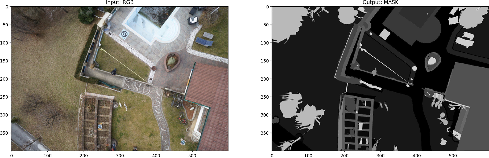
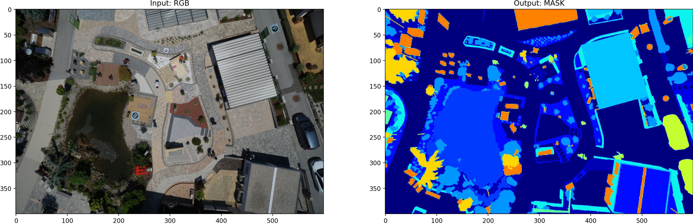
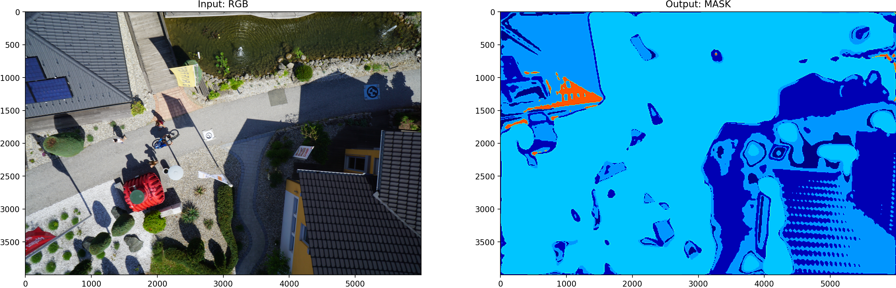

# Image Segmentation with Deep ConvNets (PyTorch)

Author: Caihao Cui

Lastest Update Time: 29-Mar-2021

Created Time: Sat 27-Mar-2021

This repo is on solving image segmentation task by building a convolutional neural network (UNet) to output a pixel-wise mask of the input image. 

 
 
The basic function will be like: Y = f(X) 

where X is a RGB image, Y is a mask image with integers represent a number of objects.  

- Review the [project organization](project_structure.txt) 
- Find details on the [Tutorial.ipynb](Tutorial.ipynb)
- Or just review the [HTML report](reports/Tutorial.html)

## Requriments
Please use `conda` or `pipenv` create a vitural environment for R&D.
This repo is develop with Python==3.8.3.
**The following packages are used in this repos (in updating)**

- pytorch == 1.7.0
- matplotlib
- pillow
- pandas
- numpy 
- tqdm 
- scikit-image 
- jupyterlab
- etc.

## TOC

1. [Data Review](#data-review)
2. [Sample Preparation](#sample-preparation)
3. [Build Model](#build-model)
4. [Manage Model](#manage-model)
5. [Prediction](#prediction) 
6. [TensorBoard](#tensorboard)
7. [Next Step](#next-step)


### Data Review  

The Full data set is save at local path as follows:
 - `data/raw`: The original, immutable data dump.
 - `data/interim`: Intermediate data that has been transformed.
 - `data/processed`: The final, canonical data sets for modeling.
 
The first step we will create basis check function to review the image sample pairs and the associated label list.
Before running the following command, make sure you activated your local python development environments.


```bash
$ python data_preparison.py 
```

You will see the following output in your terminal:

```bash
2021/03/28 17:26:20-INFO - Get Imagepair Lists
2021/03/28 17:26:20-INFO - Get Imagepair List from ./data/raw/train/images/*.jpg
2021/03/28 17:26:20-INFO - Get Imagepair List from ./data/raw/train/masks/*.png
2021/03/28 17:26:20-INFO - Create imagepair dataframe and Check labels
processed: 8:   2%|██▊                 | 7/320 [00:05<03:52,  1.35it/s]                           
...
...
2021/03/28 17:23:54-INFO - Save dataframe data/processed/df_test.csv
2021/03/28 17:23:54-INFO - Get label names from ./data/raw/labels.txt
2021/03/28 17:23:54-INFO - 3 label names are missing!
2021/03/28 17:23:54-INFO - Save dataframe data/processed/df_label.csv

```

This script is designed to review the dataset to avoid mismatch or other issues.
It will check the input RGB/GT image pair name and size. 
It will check the unique values within each target (GT) mask and count the types of labels.
Meanwhile, it will split the data set into two parts, on for training and the other for validation. 

The default split is 0.75, thus 240 of 320 images pairs will be used for training and the rest will be used for validation.

There are 80 image for test with the same resolution (W:6000px, H:4000px)  as the training dataset. 

The details are saved in the `df_xxx.csv` files. It also create a backup file if you are about to overwrite the existing files `df_xxx.csv.backup`. 

In this case,  there are three labels missing labels in the dataset, they will be replaced with "unknown_x", until we update the right label names.  We can ignore it at this moment.

--------

    data
    ├── external
    ├── interim                 <- Intermediate data that has been transformed.
    │   ├── df_data.csv         <- Training image list: names, min, max, unique label idx, etc. 
    │   └── df_data.csv.backup
    ├── processed               <- The final, canonical data sets for modeling.
    │   ├── df_label.csv        <- label names (23 in Total: [0, 1, 2, ..., 22])
    │   ├── df_label.csv.backup
    │   ├── df_test.csv         <- Image paths for test
    │   ├── df_test.csv.backup
    │   ├── df_train.csv        <- Image paths for training
    │   ├── df_train.csv.backup
    │   ├── df_valid.csv        <- Image paths for validation
    │   └── df_valid.csv.backup
    └── raw                     <- The original, immutable data dump.
        ├── labels.txt
        ├── test
        │   └── images
        └── train
            ├── images  
            └── masks

--------
 
## Sample Preparation

The basic step of the model develop is to create a framework we can keep upgrading the design and bring new ideas into practices.
Thus the `SegNet` contains the low level modules for this goals.
I named it SegNets. It contains four parts which covers almost all the feature we need for this repo. The meanings of the all sub folders are self-explanatory.
    
    SegNet
    ├── __init__.py
    ├── data
    │   ├── __init__.py
    │   ├── dataset.py
    │   ├── make_dataset.py
    │   └── review.py
    ├── features
    │   ├── __init__.py
    │   └── build_features.py
    ├── models
    │   ├── __init__.py
    │   ├── dice_loss.py
    │   └── unet.py
    └── visualization
        ├── __init__.py
        └── visualize.py     

From the `SegNet.visualization.visualize` module, we used a few function to read image pairs and plot them side by side. Here are a few samples.

To reduce the memory we resize the image to 10% of the original size. Its user's decision to adjust the setting for fitting the hardware. 






Notice the above image there tree labels identified as unknowns.


## Build Model

There different way to build a SegNet model from this repo. You can use the following command line to build the model.

```bash
$ python model_train.py -h

usage: model_train.py [-h] [-e E] [-b [B]] [-l [LR]] [-f LOAD] [-s SCALE]

Train the UNet on images and target masks

optional arguments:
  -h, --help            show this help message and exit
  -e E, --epochs E      Number of epochs (default: 2)
  -b [B], --batch-size [B]
                        Batch size (default: 2)
  -l [LR], --learning-rate [LR]
                        Learning rate (default: 0.01)
  -f LOAD, --load LOAD  Load model from a .pth file (default: False)
  -s SCALE, --scale SCALE
                        Downscaling factor of the images (default: 0.1)
```
As you can see the above arguments is just for debug and testing.

If you want to build the model with pretrained one you can try this command, showing you are loading the CP_epoch10.pth model as initiative one with batch-size = 4, epochs = 200, and downscaling factor 0.1.  

```bash
$ python model_train.py -f checkpoints/CP_epoch10.pth -b 4 -e 200 -s 0.1

# logging information
2021/03/28 18:17:47-INFO - Using device cpu
2021/03/28 18:17:47-INFO - Network:
        3 input channels
        23 output channels (classes)
        Bilinear upscaling
2021/03/28 18:17:47-INFO - Model loaded from checkpoints/CP_epoch2.pth
2021/03/28 18:17:47-INFO - Creating dataset with 240 examples
2021/03/28 18:17:47-INFO - Creating dataset with 80 examples
2021/03/28 18:17:50-INFO - Starting training:
        Epochs:          200
        Batch size:      4
        Learning rate:   0.01
        Training size:   240
        Validation size: 80
        Checkpoints:     True
        Device:          cpu
        Images scaling:  0.1
    
Epoch 1/200:   0%|              | 0/240 [00:50<?, ?img/s]
...   

```


## Manage Model

The the model will be saved at `checkpoints`. The `project_structure` is desigined to copy the best model from checkpoints to the `models` folder based on the validation performance. But, this feature is still in development. 

- Copy the best model from `checkpoints` to the `models` folder
- Add MLflow for deeper mangement.
- CI/CD with Docker k8s
- etc.

The current model is used `SegNetSmall` class defined in `SegNet.models.unet`, there are another class with more deep layers of the networks.

This design can be upgraded w.r.t different data modelling tasks. 

## Prediction

After training your model and saving it to `checkpoints` or `models`, you can easily test the output masks on your images via the CLI.

```bash
$ python model_predict.py -h

# arguments
usage: model_predict.py [-h] [--model FILE] [--input INPUT [INPUT ...]] [--output INPUT [INPUT ...]] [--viz] [--nosave] [--maskthreshold MASKTHRESHOLD] [--scale SCALE]

Predict masks from input images

optional arguments:
  -h, --help            show this help message and exit
  --model FILE, -m FILE
                        Specify the file in which the model is stored (default: MODEL.pth)
  --input INPUT [INPUT ...], -i INPUT [INPUT ...]
                        filenames of input images (default: None)
  --output INPUT [INPUT ...], -o INPUT [INPUT ...]
                        Filenames of ouput images (default: None)
  --viz, -v             Visualize the images as they are processed (default: False)
  --nosave, -n          Do not save the output masks (default: False)
  --maskthreshold MASKTHRESHOLD, -t MASKTHRESHOLD
                        Minimum probability value to consider a mask pixel white (default: 0.5)
  --scale SCALE, -s SCALE
                        Scale factor for the input images (default: 0.1)
```                        
 
For example, you can use the following command for single image prediction:

```bash
$ python model_predict.py -i data/raw/train/images/382.jpg -o output_test.png -m checkpoints/CP_epoch10.pth -s 0.1 -v
# logging information
2021/03/28 18:37:41-INFO - Starting Predict:
        model:          checkpoints/CP_epoch10.pth
        input:          ['data/raw/train/images/382.jpg']
        output:         ['output_test.png']
        viz:            True
        nosave:        False
        maskthreshold: 0.5
        scale:          0.1
    
2021/03/28 18:37:41-INFO - Loading model checkpoints/CP_epoch10.pth
2021/03/28 18:37:41-INFO - Using device cpu
2021/03/28 18:37:41-INFO - Model loaded !
2021/03/28 18:37:41-INFO - 
Predicting image data/raw/train/images/382.jpg ...
2021/03/28 18:37:44-INFO - Mask saved to output_test.png
2021/03/28 18:37:44-INFO - Visualizing results for image data/raw/train/images/382.jpg, close to continue ...
2021/03/28 18:37:48-INFO - Save imagepair at reports/predict/image_pair_jet.png
2021/03/28 18:37:55-INFO - Save imageoverlay at reports/predict/sample.png

```

You will find the output images at the `reprots/predict` folder.

You can find the current model is clearly under-fitting. But it tends to classify the input image into two categories:
- 0 : tree
- 2 : other-vegetatio
Thus, it is getting better.





 


### GPU Experimental Results

This repo is tested on PC with GTX1050Ti(4GB). Details can be found in the following [logs](reports/predict/gpu/gpu_training_log.txt).

```bash
python model_train.py -f models/CP_epoch10.pth
>>
2021/03/29 09:39:51-INFO - Using device cuda
2021/03/29 09:39:51-INFO - Network:
        3 input channels
        23 output channels (classes)
        Bilinear upscaling
2021/03/29 09:39:53-INFO - Model loaded from models/CP_epoch10.pth
2021/03/29 09:39:53-INFO - Creating dataset with 240 examples
2021/03/29 09:39:53-INFO - Creating dataset with 80 examples
2021/03/29 09:39:53-INFO - Starting training:
        Epochs:          5
        Batch size:      2
        Learning rate:   0.01
        Training size:   240
        Validation size: 80
        Checkpoints:     True
        Device:          cuda
        Images scaling:  0.1

Epoch 1/5:  50%|██████████████████████████████████████████▌                                          | 120/240 [00:46<00:41,  2.89img/s, loss (batc021/03/29 09:41:52-INFO - Validation Dice Coeff multilabel: 0.05903169760999596
Epoch 1/5: 100%|█████████████████████████████████████████████████████████████████████████████████████| 240/240 [02:41<00:00,  2.74img/s, loss (batc021/03/29 09:43:43-INFO - Validation Dice Coeff multilabel: 0.0592525490484915
Epoch 1/5: 100%|█████████████████████████████████████████████████████████████████████████████████████| 240/240 [03:51<00:00,  1.04img/s, loss (batc
2021/03/29 09:43:44-INFO - Checkpoint 1 saved !
...
09:58:35-INFO - Validation Dice Coeff multilabel: 0.06039760107299125
Epoch 5/5: 100%|█████████████████████████████████████████████████████████████████████████████████████| 240/240 [03:35<00:00,  1.11img/s, loss (batc
2021/03/29 09:58:35-INFO - Checkpoint 5 saved !
(base) ➜  image_segmentation_pytorch git:(master) ✗ python model_predict.py -i data/raw/train/images/382.jpg -o output_test_GPU.png -m checkpoints/.pth -s 0.1 -v 
2021/03/29 10:03:39-INFO - Starting Predict:     
        model:          checkpoints/CP_epoch5.pth
        input:          ['data/raw/train/images/382.jpg']
        output:         ['output_test_GPU.png']
        viz:            True
        nosave:        False
        maskthreshold: 0.5
        scale:          0.1

2021/03/29 10:03:39-INFO - Loading model checkpoints/CP_epoch5.pth
2021/03/29 10:03:40-INFO - Using device cuda
2021/03/29 10:03:41-INFO - Model loaded !
2021/03/29 10:03:41-INFO - 
Predicting image data/raw/train/images/382.jpg ...
2021/03/29 10:03:43-INFO - Mask saved to output_test_GPU.png
2021/03/29 10:03:43-INFO - Visualizing results for image data/raw/train/images/382.jpg, close to continue ...
2021/03/29 10:03:48-INFO - Save imagepair at reports/predict/image_pair_jet.png
2021/03/29 10:04:06-INFO - Save imageoverlay at reports/predict/sample.png
# Use the GPU trained model for prediction
✗ python model_predict.py -i data/raw/test/images/002.jpg -o output_test_002_GPU.png -m checkpoinch5.pth -s 0.1 -v
2021/03/29 10:05:17-INFO - Starting Predict:
        model:          checkpoints/CP_epoch5.pth
        input:          ['data/raw/test/images/002.jpg']
        output:         ['output_test_002_GPU.png']
        viz:            True
        nosave:        False
        maskthreshold: 0.5
        scale:          0.1

2021/03/29 10:05:17-INFO - Loading model checkpoints/CP_epoch5.pth
2021/03/29 10:05:18-INFO - Using device cuda
2021/03/29 10:05:20-INFO - Model loaded !
2021/03/29 10:05:20-INFO -
Predicting image data/raw/test/images/002.jpg ...
2021/03/29 10:05:21-INFO - Mask saved to output_test_002_GPU.png
2021/03/29 10:05:21-INFO - Visualizing results for image data/raw/test/images/002.jpg, close to continue ...
2021/03/29 10:05:27-INFO - Save imagepair at reports/predict/image_pair_jet.png
2021/03/29 10:05:50-INFO - Save imageoverlay at reports/predict/sample.png
```

The output I used the test image 002, here are the results.


## TensorBoard
The `model_train` script used the `TensorBoard` to store all the training and validation records of the model development process.
 
You can visualize in real time the train and test losses, the weights and gradients, along with the model predictions with tensorboard:

```bash
$ tensorboard --logdir=runs
```
And then visit ([http://localhost:6006/ ](http://localhost:6006/)) to see all the details. Here are some snapshots.

reports/TFB_screenshots/


## Next Step 

- Finish the Unit Test scripts in `tests`. Thus, `pytest` can be applied to validate the function changes. For example, the following command will runn all the function  to verify the changes, which is important for CI/CD.
```bash
$ pytest -v
===================================== test session starts ======================================
platform darwin -- Python 3.8.3, pytest-6.1.1, py-1.10.0, pluggy-0.13.1 -- /Users/caihaocui/opt/miniconda3/bin/python
cachedir: .pytest_cache
rootdir: /Users/caihaocui/Documents/GitHub/image_segmentation_pytorch
plugins: dash-1.17.0, anyio-2.0.2
collected 8 items                                                                              

tests/test_data.py::test_data PASSED                                                     [ 12%]
tests/test_feature.py::test_features PASSED                                              [ 25%]
tests/test_feature.py::test_2d_to_3d PASSED                                              [ 37%]
tests/test_feature.py::test_dice_coef PASSED                                             [ 50%]
tests/test_feature.py::test_dice_coeff_multilabel PASSED                                 [ 62%]
tests/test_models.py::test_models PASSED                                                 [ 75%]
tests/test_models.py::test_dice PASSED                                                   [ 87%]
tests/test_visualization.py::test_visualization PASSED                                   [100%]

====================================== 8 passed in 0.64s =======================================
```
- Error Analysis with Multi-labels Dice coefficient (in developing)
- Update model structure and feature modules 
    - changes should be based on Error Analysis and Class(Pixel) distributions.
- Update optimizer and training stratagies based on hardware
- Test this repo on PC with Nvidia GPU and CUDA.
- etc.


## Disclaimer 

- The python scripts (excluding the data) in this notebook can be released under [CC-BY-4.0](https://creativecommons.org/licenses/by/4.0/), which gives permission to use the content for almost any purpose (but does not grant any trademark permissions).
- This content does not represent the author's company or any associated business, clients and services.
- The author does not accept liability for any errors or omissions caused by using the contents of this notebook.

## References

- [PyTorch Docs https://pytorch.org/docs/stable/index.html](https://pytorch.org/docs/stable/index.html)
- [Pillow Docs https://pillow.readthedocs.io/en/stable/index.html](https://pillow.readthedocs.io/en/stable/index.html)

## Appendix 

What defines a good DL/ML application?

Personally speaking, a good application should contain the following features. 

- Data: from data access (Security) and IO to sample selection/preparation.
- Model: build / management / deployment (distribution).
- Report: output formats and extra features / error analysis.

The following figure shows all the details. 


## The End

--------

<p><small>Project based on the <a target="_blank" href="https://drivendata.github.io/cookiecutter-data-science/">cookiecutter data science project template</a>. #cookiecutterdatascience</small></p>
